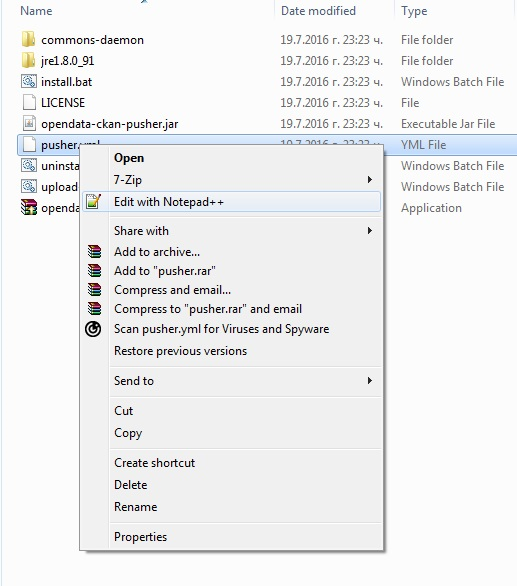
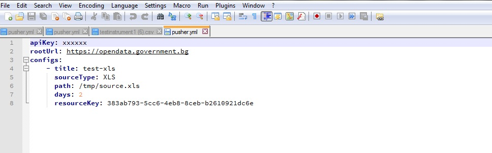

# Инструмент за автоматизирано качване на данни на портала за отворени данни

# Инсталация

1. [Свалете и инсталирайте Notepad++](https://notepad-plus-plus.org/repository/6.x/6.9.2/npp.6.9.2.Installer.exe)
2. [Свалете инсталатора на инструмента за автоматично качване от тук](https://github.com/governmentbg/opendata-ckan-pusher/releases/download/0.1/opendata-pusher.exe)
3. Стартирайте инсталатора (двоен клик с мишката).
4. Натиснете "Extract".  

5. Отворете папката, в която е инсталирано приложението (*c:\\program files\\opendata-pusher* или *c:\\program files (x86)\\opendata-pusher*).
6. Натиснете десен бутон на мишката върху **pusher.yml** и изберет "Edit with Notepad++" (Редактирай с Notepad++):  

7. Отворете [портала за отворени данни](http://opendata.government.bg) и влезте с потребителското си име и парола
8. Отворете профила си (с натискане върху името в горната дясна част на страницата) 
9. Копирайте символите след API key  

10. Поставете (paste) копираните символи на мястото на **xxxxxx** след **apiKey** в отворения в Notepad++ файл.

11. Отворете портала за отворени данни отново и отидете до ресурса, който трябва да обновявате периодично.
12. Копирайте буквите след /resource от адрес на браузъра:  

13. Поставете (paste) копираните символи на мястото на съществуващите след **resourceKey**
14. Запишете отворения в Notepad++ файл.
15. Конфигурирайте локалния ресурс (вж. следващата секция).
16. Стартирайте **install.bat** (двоен клик с мшиката)
17. След няколко дни проверете дали данните се качват на портала 

## Конфигуриране на локален ресурс

Приложението поддържа два източника на данни:

- Електронна таблица (Microsoft Excel документ)
- База данни (изисква IT специалист)

### Използване на Електронна таблица (Microsoft Excel документ)

1. Отворете отново **pusher.yml** с Notepad++
2. Заменете **/tmp/source.xls** в пътя към вашия документ (копирате пътя от адресната лента на папката и добавяте името на файла след наклонената черта)
3. Сложете значещо име вместо **test-xls**, например наименованието на ресурса
4. Ако файлът е с разширение XLSX вместо XLS, променете **XLS** на **XLSX** след sourceType
5. По подразбиране ресурсът се качва всеки ден. Ако е нужен по-голям интервал, след "days" напишете периода на качване в дни.
6. Ако има повече от един файл за качване, цялата секция от title до resourceKey се копира още веднъж и се конфигурира
7. Запишете файла

### Използване на база данни (изисква IT специалист)

Заб.: в момента се поддържат MySQL и PostgreSQL. 

1. Отворете отново pusher.yml с Notepad++
2. След path сложете избрана от вас директория, където да се генерират файлове
3. След sourceType сложете **SQL**
4. Добавете елементи "query" и "connectionString"
5. Като query сложете заявката, която извлича данните от базата
6. Като connectionString сложете низ за връзка с базата, с включени потребителско име и парола. За различните СУБД тази стойност е различна, като съответната може да бъде намерена например чрез търсене на "java MySQL connection string" 
7. Ако има повече от един файл за качване, цялата секция от title до resourceKey се копира още веднъж и се конфигурира
8. Запишете файла